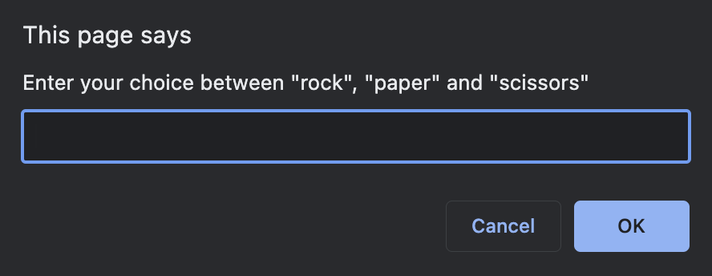
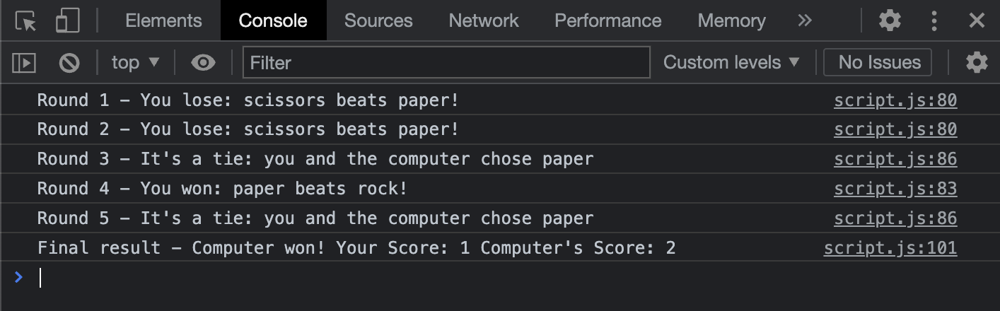

# Rock, Paper and Scissors

## Introduction

In this game you will play against the computer the grade-class game ["Rock, Paper and Scissors"](https://www.wikihow.com/Play-Rock,-Paper,-Scissors).
You will be asked for a choice between 'Rock', 'Paper' or 'Scissors' 5 times. After 5th round, the score for each round and the final score is computed on the [browser console](https://screenful.com/how-to-open-the-browser-console#:~:text=The%20browser%20developer%20console%20is,how%20to%20solve%20an%20issue.).

## How to start the game

For the moment, the game should be played from the browser console.
Open the index.html file, which for now shows a blank page. As soon as the browser opens, you'll be prompted for a choice between **rock**, **paper** or **scissors**. Play alog the five rounds.

To view the results, open the browser console. Press the `Cmd` + `option` + `J` keys on a Mac, or `Shift` + `Ctrl` + `J` on Windows machines.

## Concepts applied

- Variables: const, let and var
- Arrays: how to make the computer randomly choose between a pre-defined set of values
- Loops:
  - Do While loop: prompt the user for their choice n times until the correct spelling of _rock_, _paper_ and _scissors_ is given
  - For loop: to run 5 rounds of the game by prompting the user for their choice each time
- String functions: `toLowerCase()` make user's input case-insensitive
- Conditionals:
  - Switch statement: to check who wins the round based on any combination of _rock_, _paper_ and _scissors_
  - If...Else statements: to check who wins the game
- Template literals: to log on the console each intermediate result and the final result of the game

## Struggles

I tried to use `switch` statement instead of `If... Else`, but the program returned incorrect values.
After a closer look at my code, I noticed I was using **Bitwise AND** operator `&` instead of the **Binary Logic** operator `&&` in the `case` clause. It was quite hard to discover as it didn't generate a `SyntaxError` message. A small and silly mistake that took a good while and a lot of brain power to solve.

## Final Thoughts

In this very first stage of the game, I could practice the fundamentals of JavaScript. It's solely developed for browser console output. Next step is to transfer the gameplay to the browser window instead, appling HTML and CSS to improve the player experience.
